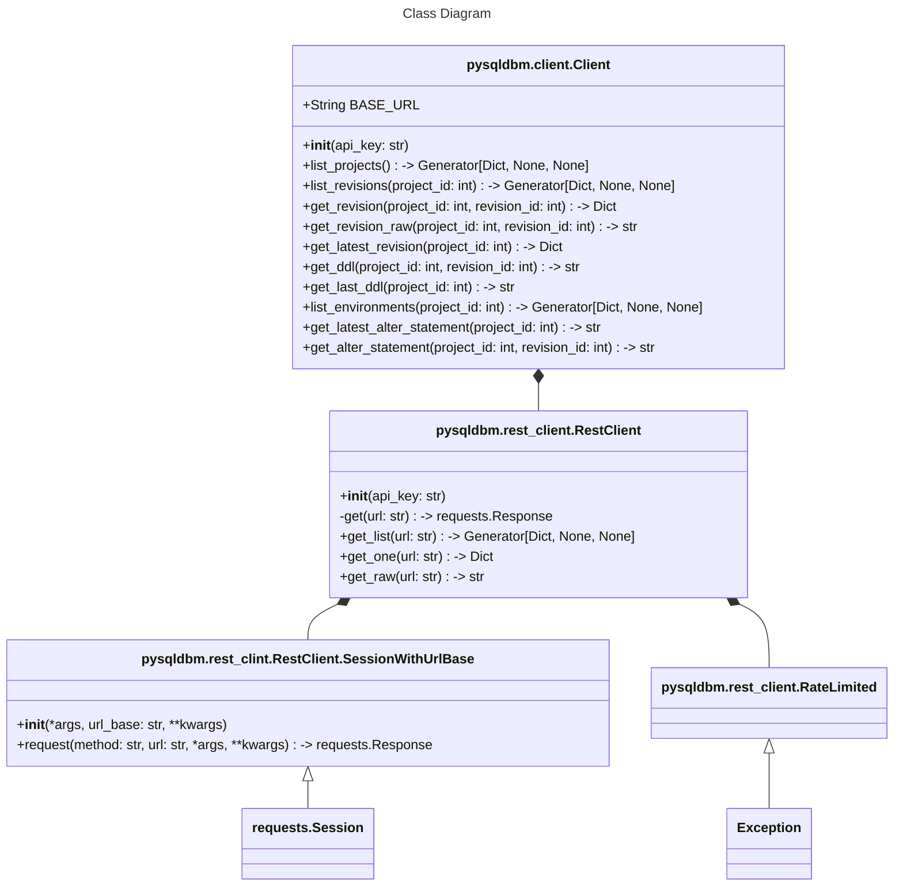

# Architecture

## `pysqldbm.client.Client`

`pysqldbm.client.Client` is a wrapper around the [SQLDBM API](https://developers.sqldbm.com/). It uses
`pysqldbm.rest_client.RestClient` to make calls directly to the API.

Each method in the`pysqldbm.client.Client` class follows one of the following patterns:

### `list_resource(...) -> Generator[Dict, None, None]`

Will return a generator that will yield each resource in the list.

```python
    def list_resource(self, resource_id: int) -> Generator[Dict, None, None]:
        return self._rest.get_list("resource")
        # or
        return self._rest.get_list(f"resource/{resource_id}")
        # or
        return self._rest.get_list(f"resource/{resource_id}/sub-resource")
```

### `get_resource(resource_id: int) -> Dict`

Returns a single resource.

```python
    def get_resource(self, resource_id: int) -> Dict:
        return self._rest.get_one(f"resource/{resource_id}")
```

### `get_resource(resurce_id: int) -> str`

Returns a single resource as a string.

```python
    def get_resource(self, resource_id: int) -> str:
        return self._rest.get_raw(f"resource/{resource_id}/raw-doc")
```

## `pysqldbm.rest_client.RestClient`

The rest client is responsible for making requests to the SQLDBM API. Currently only GET requests are supported by the
SQLDBM API.

All requests are routed through `RestClient.get(...)` which is wrapped in a jittered exponential backoff decorator. If a
429 status code is returned (the SQLDBM documentation specifies this) the request will be re-tried less and less
friendly on a jittered interval.

A custom `pysqldbm.rest_client.RestClient.SessionWithUrlBase` class is used in place of `requests.Session` so as to
remove the requirement to repeatedly pass the base url to `RestClient.get(...)`.

# Class Diagram


